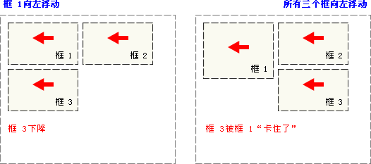

#W3C School CSS 起步

#层叠次序

1. 浏览器缺省设置
1. 外部样式表
1. 内部样式表（位于 <head> 标签内部）
1. 内联样式（在 HTML 元素内部）

*4为最强*

#基本语法
```css
h1,h2,h3 {color:red; font-size:14px; font-family: "sans serif";}
```

CSS 对大小写不敏感。*不过存在一个例外：如果涉及到与 HTML 文档一起工作的话，`class` 和 `id` 名称对大小写是敏感的。*

#继承
根据 CSS，子元素从父元素继承属性。
```css
body {
     font-family: Verdana, sans-serif;
     }
```

子元素将继承最高级元素（在本例中是 body）所拥有的属性（这些子元素诸如 p, td, ul, ol, ul, li, dl, dt,和 dd）。

但是依然可以定义子元素的属性。以最下级为准。
```css
p  {
     font-family: Times, "Times New Roman", serif;
     }
```

#派生选择器 : 多级限定
```css
strong {
     color: red;
     }

h2 {
     color: red;
     }

h2 strong {
     color: blue;
     }
```

结果
```html
<p>The strongly emphasized word in this paragraph is<strong>red</strong>.</p>
<h2>This subhead is also red.</h2>
<h2>The strongly emphasized word in this subhead is<strong>blue</strong>.</h2>
```

#id 选择器
```css
#red {color:red;}
#green {color:green;}
```

结果
```html
<p id="red">这个段落是红色。</p>
<p id="green">这个段落是绿色。</p>
```

##with 派生选择器
```css
#sidebar p {
    font-style: italic;
    text-align: right;
    margin-top: 0.5em;
    }
```

`id=sidebar` 的这个元素很可能是 div 或者是表格单元。其 `<p>` 子元素使用了定义的样式。

#类选择器
```css
.center {text-align: center}
```

作用于
```html
<h1 class="center">
This heading will be center-aligned
</h1>

<p class="center">
This paragraph will also be center-aligned.
</p>
```

`h1` 和 `p` 元素都有 center 类。这意味着两者都将遵守 ".center" 选择器中的规则。

*Tips: Sublime选中一个范围按'`'会自动把这部分圈起来*

##with 派生选择器
```css
.fancy td {
    color: #f60;
    background: #666;
    }
```

类名为 fancy 的更大的元素内部的表格单元都会以灰色背景显示橙色文字. 如`<div class="fancy"><tabel><td>这个td元素` 有趣的是 `<td class="fancy">` 对本级的id都无效！必须是父级元素的id才行。

和下面的不同：

##限定类选择器
```css
td.fancy {
    color: #f60;
    background: #666;
    }
```

这个选择器只对 `<td class="fancy">` 起作用。

#属性选择器

**必须规定`!DOCTYPE`**

##存在属性即应用
```css
[title]
{
color:red;
}
```

```html
<h1>可以应用样式：</h1>
<h2 title="Hello world">Hello world</h2>
<a title="W3School" href="http://w3school.com.cn">W3School</a>

<hr />

<h1>无法应用样式：</h1>
<h2>Hello world</h2>
<a href="http://w3school.com.cn">W3School</a>
```

##属性为指定值才应用
```css
[title=W3School]
{
border:5px solid blue;
}
```

```html
<h1>可以应用样式：</h1>

<br />
<a title="W3School" href="http://w3school.com.cn">W3School</a>
<hr />

<h1>无法应用样式：</h1>
<p title="greeting">Hi!</p>
<a class="W3School" href="http://w3school.com.cn">W3School</a>
```

##属性值可由空格隔开，作为值的集合
```css
[title~=hello]
{
color:red;
} 
```

```html
<h1>可以应用样式：</h1>
<h2 title="hello world">Hello world</h2>
<p title="student hello">Hello W3School students!</h1>
<hr />

<h1>无法应用样式：</h1>
<h2 title="world">Hello world</h2>
<p title="student">Hello W3School students!</p>
```

##属性值也可由连字符隔开
用于选取带有以指定值开头的属性值的元素，该值必须是整个单词
```css
[lang|=en]
{
color:red;
}
```

```html
<h1>可以应用样式：</h1>
<p lang="en">Hello!</p>
<p lang="en-us">Hi!</p>
<hr />

<h1>无法应用样式：</h1>
<p lang="us">Hi!</p>
<p lang="zh">Hao!</p>
```

##匹配元素的选择器
```css
input[type="text"]
{
  width:150px;
  display:block;
  margin-bottom:10px;
  background-color:yellow;
  font-family: Verdana, Arial;
}
```

作用于
```html
<input type="text">
<!-- 对以下无效 -->
<input type="password">
```

##其他

- [attribute^=value]  指定值开头的每个元素。
- [attribute$=value]  匹配属性值以指定值结尾的每个元素。
- [attribute*=value]  匹配属性值中包含指定值的每个元素。

---
2016-4-14 5:00

---
2016-4-14 17:50

#字体优先级
```css
p {font-family: Times, TimesNR, 'New Century Schoolbook',
     Georgia, 'New York', serif;}
```

一条规则里多个属性`,`分割，即按照优先顺序排列。
有当字体名中有一个或多个空格（比如 New York），或者如果字体名包括 # 或 $ 之类的符号，需要在 font-family 声明中加引号。

如果把一个 font-family 属性放在 HTML 的 style 属性中，则需要使用该属性本身未使用的那种引号：
```html
<p style="font-family: Times, TimesNR, 'New Century Schoolbook', Georgia,
 'New York', serif;">...</p>
```

#字体大小
>绝对值：
将文本设置为指定的大小
不允许用户在所有浏览器中改变文本大小（不利于可用性）
绝对大小在确定了输出的物理尺寸时很有用

>相对大小：
相对于周围的元素来设置大小
允许用户在浏览器改变文本大小

>默认: 普通文本（比如段落）的大小是 16 像素。

##使用 em 来设置字体大小

W3C 推荐使用 em 尺寸单位。
1em 等于当前的字体尺寸。如果一个元素的 font-size 为 16 像素，那么对于该元素，1em 就等于 16 像素。在设置字体大小时，em 的值会相对于父元素的字体大小改变。
浏览器中默认的文本大小是 16 像素。因此 1em 的默认尺寸是 16 像素。
可以使用下面这个公式将像素转换为 em：pixels/父元素的默认字体大小=em

##推荐
```css
body {font-size:100%;}
h1 {font-size:3.75em;}
h2 {font-size:2.5em;}
p {font-size:0.875em;}
```

在所有浏览器中，可以显示相同的文本大小，并允许所有浏览器缩放文本的大小。

#链接
链接的四种状态：

- a:link - 普通的、未被访问的链接
- a:visited - 用户已访问的链接
- a:hover - 鼠标指针位于链接的上方
- a:active - 链接被点击的时刻

```html
<!DOCTYPE html>
<html>
<head>
<style>
a:link {color:#FF0000;}    /* 未被访问的链接 */
a:visited {color:#00FF00;} /* 已被访问的链接 */
a:hover {color:#FF00FF;}   /* 鼠标指针移动到链接上 */
a:active {color:#0000FF;}  /* 正在被点击的链接 */
</style>
</head>

<body>
<p><b><a href="/index.html" target="_blank">这是一个链接</a></b></p>
<p><b>注释：</b>为了使定义生效，a:hover 必须位于 a:link 和 a:visited 之后！！</p>
<p><b>注释：</b>为了使定义生效，a:active 必须位于 a:hover 之后！！</p>
</body>
</html>
```

##去掉链接中的下划线
```css
a:link {text-decoration:none;}
```

#简写样式
```css
li {list-style : url(example.gif) square inside}
```

不限顺序。不写为默认。

#表格
##单一边框
```css
table
  {
  border-collapse:collapse;
  }
```

#通用选择器
```css
* {
  margin: 0;
  padding: 0;
}
```

所有元素适用。

#单位

<table class="dataintable">
  <tr>
    <th style="width:22%;">单位</th>
    <th>描述</th>
  </tr>
  <tr>
    <td>%</td>
    <td>百分比</td>
  </tr>
  <tr>
    <td>in</td>
    <td>英寸</td>
  </tr>
  <tr>
    <td>cm</td>
    <td>厘米</td>
  </tr>
  <tr>
    <td>mm</td>
    <td>毫米</td>
  </tr>
  <tr>
    <td>em</td>
    <td>
    <p>1em 等于当前的字体尺寸。</p>
    <p>2em 等于当前字体尺寸的两倍。</p>
    <p>例如，如果某元素以 12pt 显示，那么 2em 是24pt。</p>
    <p>在 CSS 中，em 是非常有用的单位，因为它可以自动适应用户所使用的字体。</p>
    </td>
  </tr>
  <tr>
    <td>ex</td>
    <td>一个 ex 是一个字体的 x-height。 (x-height 通常是字体尺寸的一半。)</td>
  </tr>
  <tr>
    <td>pt</td>
    <td>磅 (1 pt 等于 1/72 英寸)</td>
  </tr>
  <tr>
    <td>pc</td>
    <td>12 点活字 (1 pc 等于 12 点)</td>
  </tr>
  <tr>
    <td>px</td>
    <td>像素 (计算机屏幕上的一个点)</td>
  </tr>
</table>

#框


*提示：外边距可以是负值，而且在很多情况下都要使用负值的外边距。*

##内边距 padding
元素边框与元素内容之间的空白区域。
**padding 属性接受长度值或百分比值，但不允许使用负值。**

```css
h1 {
  padding-top: 10px;
  padding-right: 0.25em;
  padding-bottom: 2ex;
  padding-left: 20%; 
  }
```

**百分数值是相对于其父元素的 width 计算的，这一点与外边距一样。**
```html        
<head>
<style type="text/css">
td {padding-left: 30%}
table {border-style: solid; width: 400px;}
</style>
</head>

<body>
<table>
<tr>
<td>
这个表格单元拥有左内边距。
</td>
<td>
这个表格单元拥有左内边距。
</td>
</tr>
</table>
```

##值复制
采用了 top-right-bottom-left 的顺序 : top开始，顺时针


如果为外边距指定了 3 个值，则第 4 个值（即左外边距）会从第 2 个值（右外边距）复制得到。如果给定了两个值，第 4 个值会从第 2 个值复制得到，第 3 个值（下外边距）会从第 1 个值（上外边距）复制得到。最后一个情况，如果只给定一个值，那么其他 3 个外边距都由这个值（上外边距）复制得到。

```css
p.aside {border-style: solid dotted dashed double;}
```


```css
这两种方法是等价的
p {border-style: solid solid solid none;}
p {border-style: solid; border-left-style: none;}
```

**注意：如果要使用第二种方法，必须把单边属性放在简写属性之后。因为如果把单边属性放在 border-style 之前，简写属性的值就会覆盖单边值 none。**

```css
这两种方法是等价的
top=buttom=15px, left=right=5px
p {border-style: solid; border-width: 15px 5px 15px 5px;}
p {border-style: solid; border-width: 15px 5px;}
```


##边框

```css
a:link, a:visited {
  border-style: solid;
  border-width: 5px;
  border-color: transparent;
  }
a:hover {border-color: gray;}
```

`transparent`: 从某种意义上说，利用 transparent，使用边框就像是额外的内边距一样；此外还有一个好处，就是能在你需要的时候使其可见。
`<a href="#">AAA</a>` `href="#"`:本页。

###没有边框

```css
p {border-style: none; border-width: 50px;}
```

尽管边框的宽度是 50px，但是边框样式设置为 none。在这种情况下，边框根本不存在，那么边框就不可能有宽度，因此边框宽度自动设置为 0，而不论您原先定义的是什么。

```css
h1 {border-width: 20px;}
```

由于 border-style 的默认值是 none，如果没有声明样式，就相当于 border-style: none。**因此，如果您希望边框出现，就必须声明一个边框样式。**

##CSS 外边距

###CSS 外边距合并

外边距合并指的是，当两个垂直外边距相遇时，它们将形成一个外边距。
合并后的外边距的高度等于两个发生合并的外边距的高度中的较大者。

```html
<html>
<head>

<style type="text/css">
* {
  margin:0;
  padding:0;
  border:0;
}

#d1 {
  width:100px;
  height:100px;
  margin-top:20px;
  margin-bottom:20px;
  background-color:red;
}

#d2 {
  width:100px;
  height:100px;
  margin-top:10px;
  background-color:blue;
}

</style>
</head>

<body>

<div id="d1">
</div>

<div id="d2">
</div>

<p>请注意，两个 div 之间的外边距是 20px，而不是 30px（20px + 10px）。</p>
</body>
</html>
```


任意相交的margin都会发生合并
```html
<html>
<head>

<style type="text/css">
* {
  margin:0;
  padding:0;
  border:0;
}

#outer {
  width:300px;
  height:300px;
  background-color:red;
  margin-top:20px;
}

#inner {
  width:50px;
  height:50px;
  background-color:blue;
  margin-top:10px;
}

</style>
</head>

<body>

<div id="outer">
  <div id="inner">
  </div>
</div>

<p>注释：请注意，如果不设置 div 的内边距和边框，那么内部 div 的上外边距将与外部 div 的上外边距合并（叠加）。</p>
</body>
</html>
```


#定位

##一切皆为框
>div、h1 或 p 元素常常被称为块级元素。这意味着这些元素显示为一块内容，即“块框”。与之相反，span 和 strong 等元素称为“行内元素”，这是因为它们的内容显示在行中，即“行内框”。

>您可以使用 display 属性改变生成的框的类型。这意味着，通过将 display 属性设置为 block，可以让行内元素（比如 `<a>` 元素）表现得像块级元素一样。还可以通过把 display 设置为 none，让生成的元素根本没有框。这样的话，该框及其所有内容就不再显示，不占用文档中的空间。

##定位机制
>CSS 有三种基本的定位机制：普通流、浮动和绝对定位。

>除非专门指定，否则所有框都在普通流中定位。也就是说，普通流中的元素的位置由元素在 (X)HTML 中的位置决定。

>块级框从上到下一个接一个地排列，框之间的垂直距离是由框的垂直外边距计算出来。

>行内框在一行中水平布置。可以使用水平内边距、边框和外边距调整它们的间距。但是，垂直内边距、边框和外边距不影响行内框的高度。由一行形成的水平框称为行框（Line Box），行框的高度总是足以容纳它包含的所有行内框。不过，设置行高可以增加这个框的高度。

###定位机制 position 属性

- static
元素框正常生成。块级元素生成一个矩形框，作为文档流的一部分，行内元素则会创建一个或多个行框，置于其父元素中。

- relative
元素框偏移某个距离。元素仍保持其未定位前的形状，它原本所占的空间仍保留。

```html
<html>
<head>
<style type="text/css">
h2.pos_left
{
position:relative;
left:-20px
}
</style>
</head>

<body>
<h2>这是位于正常位置的标题</h2>
<h2 class="pos_left">这个标题相对于其正常位置向左移动</h2>

<p>相对定位会按照元素的原始位置对该元素进行移动。</p>
<p>样式 "left:-20px" 从元素的原始左侧位置减去 20 像素。</p>
</body>

</html>
```


- absolute
元素框从文档流完全删除，并相对于其包含块定位。包含块可能是文档中的另一个元素或者是初始包含块。元素原先在正常文档流中所占的空间会关闭，就好像元素原来不存在一样。元素定位后生成一个块级框，而不论原来它在正常流中生成何种类型的框。
```html
<html>
<head>
<style type="text/css">
h2.pos_abs
{
position:absolute;
left:100px;
top:15px
}
</style>
</head>

<body>
<h2 class="pos_abs">这是带有绝对定位的标题</h2>
<p>通过绝对定位，元素可以放置到页面上的任何位置。下面的标题距离页面左侧 100px，距离页面顶部 150px。通过绝对定位，元素可以放置到页面上的任何位置。下面的标题距离页面左侧 100px，距离页面顶部 150px。通过绝对定位，元素可以放置到页面上的任何位置。下面的标题距离页面左侧 100px，距离页面顶部 150px。通过绝对定位，元素可以放置到页面上的任何位置。下面的标题距离页面左侧 100px，距离页面顶部 150px。
结果就是重叠显示了2部分文字</p>
</body>

</html>
```


- fixed
元素框的表现类似于将 position 设置为 absolute，不过其包含块是视窗本身。

##溢出处理
```html
<html>
<head>
<style type="text/css">
div 
{
background-color:#00FFFF;
width:150px;
height:150px;
overflow: scroll;
}
</style>
</head>

<body>
<p>如果元素中的内容超出了给定的宽度和高度属性，overflow 属性可以确定是否显示滚动条等行为。</p>

<div>
这个属性定义溢出元素内容区的内容会如何处理。如果值为 scroll，不论是否需要，用户代理都会提供一种滚动机制。因此，有可能即使元素框中可以放下所有内容也会出现滚动条。默认值是 visible。
</div>
</body>

</html>
```

- visible 默认值。内容不会被修剪，会呈现在元素框之外。
- hidden  内容会被修剪，并且其余内容是不可见的。
- scroll  内容会被修剪，但是浏览器会显示滚动条以便查看其余的内容。
- auto  如果内容被修剪，则浏览器会显示滚动条以便查看其余的内容。
- inherit 规定应该从父元素继承 overflow 属性的值。


##裁剪
clip 属性剪裁**绝对定位元素**。
当一幅图像的尺寸大于包含它的元素时会发生什么呢？"clip" 属性允许您规定一个元素的可见尺寸，这样此元素就会被修剪并显示为这个形状。
```html
<html>
<head>
<style type="text/css">
img 
{
position:absolute;
clip:rect(0px 50px 200px 0px)
}
</style>
</head>

<body>
<p>clip 属性剪切了一幅图像：</p>
<p></p>
</body>

</html>
```

##图层优先级 z-index
仅能在定位元素上奏效（例如 position:absolute;）
```html
<html>
<head>
<style type="text/css">
img.x
{
position:absolute;
left:0px;
top:0px;
z-index:-1
}
</style>
</head>

<body>
<h1>这是一个标题</h1>
 
<p>默认的 z-index 是 0。Z-index -1 拥有更低的优先级。</p>
</body>

</html>
```

##相对定位

设置垂直或水平位置，让这个元素“相对于”它的起点进行移动。

```html
<html>
<head>
<style type="text/css">
h2.pos_top
{
position:relative;
top:-40px
}
</style>
</head>

<body>
<h2>这是位于正常位置的标题</h2>
<h2 class="pos_top">这个标题相对于其正常位置向上移动</h2>

<p>相对定位会按照元素的原始位置对该元素进行移动。</p>
<p>样式 "left:-20px" 从元素的原始左侧位置减去 20 像素。</p>
元素仍然占据原来的空间。因此，移动元素会导致它覆盖其它框。
</body>

</html>
```


##绝对定位
>绝对定位使元素的位置与文档流无关，因此不占据空间。这一点与相对定位不同，相对定位实际上被看作普通流定位模型的一部分，因为元素的位置相对于它在普通流中的位置。普通流中其它元素的布局就像绝对定位的元素不存在一样.


##浮动
>浮动的框可以向左或向右移动，直到它的外边缘碰到包含框或另一个浮动框的边框为止。
由于浮动框不在文档的普通流中，所以文档的普通流中的块框表现得就像浮动框不存在一样。

>浮动框旁边的行框被缩短，从而给浮动框留出空间，行框围绕浮动框。

- 它的右边缘碰到包含框的右边缘：


- 当框 1 向左浮动时，它脱离文档流并且向左移动，直到它的左边缘碰到包含框的左边缘。因为它不再处于文档流中，所以它不占据空间，实际上覆盖住了框 2，使框 2 从视图中消失。

- 如果把所有三个框都向左移动，那么框 1 向左浮动直到碰到包含框，另外两个框向左浮动直到碰到前一个浮动框。


- 如果包含框太窄，无法容纳水平排列的三个浮动元素，那么其它浮动块向下移动，直到有足够的空间。如果浮动元素的高度不同，那么当它们向下移动时可能被其它浮动元素“卡住”：



```html
<html>
<head>
<style type="text/css">
div
{
float:right;
width:120px;
margin:0 0 15px 20px;
padding:15px;
border:1px solid black;
text-align:center;
}
</style>
</head>

<body>
<div>
<br />
CSS is fun!
</div>
<p>
This is some text. This is some text. This is some text.
This is some text. This is some text. This is some text.
This is some text. This is some text. This is some text.
This is some text. This is some text. This is some text.
This is some text. This is some text. This is some text.
This is some text. This is some text. This is some text.
This is some text. This is some text. This is some text.
This is some text. This is some text. This is some text.
This is some text. This is some text. This is some text.
This is some text. This is some text. This is some text.
This is some text. This is some text. This is some text.
This is some text. This is some text. This is some text.
This is some text. This is some text. This is some text.
</p>

<p>
在上面的段落中，div 元素的宽度是 120 像素，它其中包含图像。div 元素浮动到右侧。我们向 div 元素添加了外边距，这样就可以把 div 推离文本。同时，我们还向 div 添加了边框和内边距。
</p>
</body>

</html>
```

###Clear
正常情况下，不浮动的框会为浮动的框做绕排，通过`clear:`定义：

>图像的左侧or右侧不允许出现浮动元素

```css
{
  clear:both; //left,right
}
```

####使用clear做清理


```html
.news {
  background-color: gray;
  border: solid 1px black;
  }

.news img {
  float: left;
  }

.news p {
  float: right;
  }

.clear {
  clear: both;
  }

<div class="news">

<p>some text</p>

<div class="clear"></div>

</div>
```


###使用 浮动 制作的目录
```html
<html>
<head>
<style type="text/css">
ul
{
float:left;
width:100%;
padding:0;
margin:0;
list-style-type:none;
}
a
{
float:left;
width:7em;
text-decoration:none;
color:white;
background-color:purple;
padding:0.2em 0.6em;
border-right:1px solid white;
}
a:hover {background-color:#ff3300}
li {display:inline}
</style>
</head>

<body>
<ul>
<li><a href="#">Link one</a></li>
<li><a href="#">Link two</a></li>
<li><a href="#">Link three</a></li>
<li><a href="#">Link four</a></li>
</ul>

<p>
在上面的例子中，我们把 ul 元素和 a 元素浮向左浮动。li 元素显示为行内元素（元素前后没有换行）。这样就可以使列表排列成一行。ul 元素的宽度是 100%，列表中的每个超链接的宽度是 7em（当前字体尺寸的 7 倍）
</p>

</body>
</html>
```


###使用 浮动 制作网页框架结构
```html
<html>
<head>
<style type="text/css">
div.container
{
width:100%;
margin:0px;
border:1px solid gray;
line-height:150%;
}
div.header,div.footer
{
padding:0.5em;
color:white;
background-color:gray;
clear:left;
}
h1.header
{
padding:0;
margin:0;
}
div.left
{
float:left;
width:160px;
margin:0;
padding:1em;
}
div.content
{
margin-left:190px;
border-left:1px solid gray;
padding:1em;
}
</style>
</head>
<body>

<div class="container">

<div class="header"><h1 class="header">W3School.com.cn</h1></div>

<div class="left"><p>"Never increase, beyond what is necessary, the number of entities required to explain anything." William of Ockham (1285-1349)</p></div>

<div class="content">
<h2>Free Web Building Tutorials</h2>
<p>At W3School.com.cn you will find all the Web-building tutorials you need,
from basic HTML and XHTML to advanced XML, XSL, Multimedia and WAP.</p>
<p>W3School.com.cn - The Largest Web Developers Site On The Net!</p></div>

<div class="footer">Copyright 2008 by YingKe Investment.</div>
</div>

</body>
</html>

```


---
2016-4-15 5:00


#对齐

##对齐块元素

块元素指的是占据全部可用宽度的元素，并且在其前后都会换行。

###使用 margin 属性来水平对齐

可通过将左和右外边距设置为 "auto",均等地分配可用的外边距。
```html
<!DOCTYPE html>
<html>
<head>
<style>
.center
{
margin:auto;
width:70%;
background-color:#b0e0e6;
}
</style>
</head>

<body>

<div class="center">
<p>这是一个段落。这是一个段落。这是一个段落。这是一个段落。这是一个段落。</p>
<p>这是一个段落。这是一个段落。这是一个段落。这是一个段落。这是一个段落。</p>
</div>

<p><b>注释：</b>除非已经声明了 !DOCTYPE，否则使用 margin:auto 在 IE8 以及更早的版本中是无效的。</p>
</body>
</html>
```

*如果宽度是 100%，则对齐没有效果。*

---
2016-4-15 16:45

