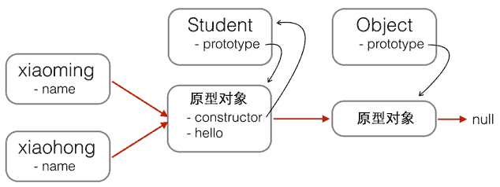

#JS 继承机制 猜想和整理2 关于 构造函数的继承

##0. 对于构造函数
```js
function Student(props) {
    this.name = props.name || 'Unnamed';
}

Student.prototype.hello = function () {
    alert('Hello, ' + this.name + '!');
}
```

Student的原型链：



我们要 基于Student扩展出PrimaryStudent。

##2. 最基础的方式

```js
function PrimaryStudent(props) {
    // 调用Student构造函数，绑定this变量:
    Student.call(this, props);
    this.grade = props.grade || 1;
}
```

但是，调用了Student构造函数不等于继承了Student，PrimaryStudent创建的对象的原型是：
```
new PrimaryStudent() ----> PrimaryStudent.prototype ----> Object.prototype ----> null
```

我们所需的是
```
new PrimaryStudent() ----> PrimaryStudent.prototype ----> Student.prototype ----> Object.prototype ----> null
```

如果你想用最简单粗暴的方法这么干：

```
PrimaryStudent.prototype = Student.prototype;
```


是不行的！如果这样的话，PrimaryStudent和Student共享一个原型对象，那还要定义PrimaryStudent干啥？

##感觉它实际要达成的是

```
PrimaryStudent.prototype.prototype = Student.prototype;
```

同样的，
```
PrimaryStudent.prototype = Student
```

也是不对的。这样的话，一个prototype竟然指向了一个构造函数。

```
PrimaryStudent.prototype = new Student();
```

~~猜测感觉这样是行得通的。~~
然而不行，原因：

>用Child.prototype = new Parent();替换了Child.prototype = new F();，免去了F()的定义。

>这个代码对于大部分情况可能是正常的，但是，当你定义了一个这样的函数:

```
function Student(name) {
    this.name = name.toUpperCase();
}
```

>你的Child.prototype = new Parent()将直接报错，因为name是undefined，你不得不改成：

```
Child.prototype = new Parent('')
```

>如果遇到另一种新的对象要传入number呢？

```
function Person(birth) {
    this.age = 2016 - birth;
}
```

>也就是说，你得为每个需要继承的对象编写特定的inherits()函数。

>空函数F()能保证new F()正常执行，所有的继承用一个inherits()都能正常处理。

##3. 借助一个中间对象来实现正确的原型链
这个中间对象的原型要指向Student.prototype。为了实现这一点，参考道爷（就是发明JSON的那个道格拉斯）的代码，中间对象可以用一个空函数F来实现：
```js
// PrimaryStudent构造函数:
function PrimaryStudent(props) {
    Student.call(this, props);
    this.grade = props.grade || 1;
}

// 空函数F，其实是一个构造函数，只是为空。
function F() {
}

// 把F的原型指向Student.prototype:
F.prototype = Student.prototype;

// 把PrimaryStudent的原型指向一个新的F对象，F对象的原型正好指向Student.prototype:
PrimaryStudent.prototype = new F();

// 把PrimaryStudent原型的构造函数修复为PrimaryStudent:
// 任何一个prototype对象都有一个constructor属性，指向它的构造函数。执行"PrimaryStudent.prototype = new F();"这一行的结果就是
// PrimaryStudent.prototype.constructor原本是指向PrimaryStudent的；执行之后，PrimaryStudent.prototype.constructor指向F。

PrimaryStudent.prototype.constructor = PrimaryStudent;

// 继续在PrimaryStudent原型（就是new F()对象）上定义方法：
PrimaryStudent.prototype.getGrade = function () {
    return this.grade;
};

// 创建xiaoming:
var xiaoming = new PrimaryStudent({
    name: '小明',
    grade: 2
});
xiaoming.name; // '小明'
xiaoming.grade; // 2

// 验证原型:
xiaoming.__proto__ === PrimaryStudent.prototype; // true
xiaoming.__proto__.__proto__ === Student.prototype; // true

// 验证继承关系:
xiaoming instanceof PrimaryStudent; // true
xiaoming instanceof Student; // true
```

用一张图来表示新的原型链：


注意，函数F仅用于桥接，我们仅创建了一个`new F()`实例，而且，没有改变原有的Student定义的原型链。

如果把继承这个动作用一个`extend()`函数封装起来，还可以隐藏F的定义，并简化代码：
```js
function extend(Child, Parent) {
    var F = function () {};
    F.prototype = Parent.prototype;
    Child.prototype = new F();
    Child.prototype.constructor = Child;
}
```

这个`extend()`函数可以复用：
```js
function Student(props) {
    this.name = props.name || 'Unnamed';
}

Student.prototype.hello = function () {
    alert('Hello, ' + this.name + '!');
}

function PrimaryStudent(props) {
    Student.call(this, props);
    this.grade = props.grade || 1;
}

// 实现原型继承链:
extend(PrimaryStudent, Student);

// 绑定其他方法到PrimaryStudent原型:
PrimaryStudent.prototype.getGrade = function () {
    return this.grade;
};
```

##实验
```js
function Fruit(name){this.name = name};
function Apple(sweet){this.sweet = sweet};
extend(Apple,Fruit);

Apple.prototype; //Fruit {}
Apple.name; //"Apple"
Apple instanceof Fruit; //false 它是一个构造函数

var aapple = new Apple(4);
aapple; //Apple {sweet: 4}sweet: 4__proto__: Fruit
aapple.name; //undefined

Object.name; //"Object"
```

发现一个严重的问题。`name`属性是一个预留属性。本来就会存在。改为`pigu`。

```js
function Fruit(pigu){this.pigu = pigu};
Fruit.prototype.cate = "shuiguo";
function Apple(sweet){this.sweet = sweet};

extend(Apple,Fruit);

Apple; //Apple(sweet){this.sweet = sweet}
Apple.name; //"Apple"
Apple.prototype; //Fruit {}
Apple instanceof Fruit; //false
Apple.pigu; //undefined

var aa = new Apple(5);
aa.sweet; //5
aa.cate; //"shuiguo"
aa instanceof Apple; //true
aa instanceof Fruit; //true
```


#参考
[廖雪峰：JavaScript教程-原型继承](http://www.liaoxuefeng.com/wiki/001434446689867b27157e896e74d51a89c25cc8b43bdb3000/0014344997013405abfb7f0e1904a04ba6898a384b1e925000)

[阮一峰：Javascript面向对象编程（二）：构造函数的继承](http://www.ruanyifeng.com/blog/2010/05/object-oriented_javascript_inheritance.html)